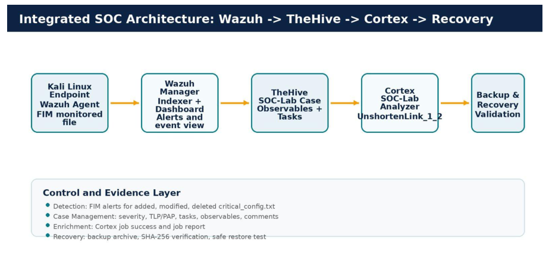
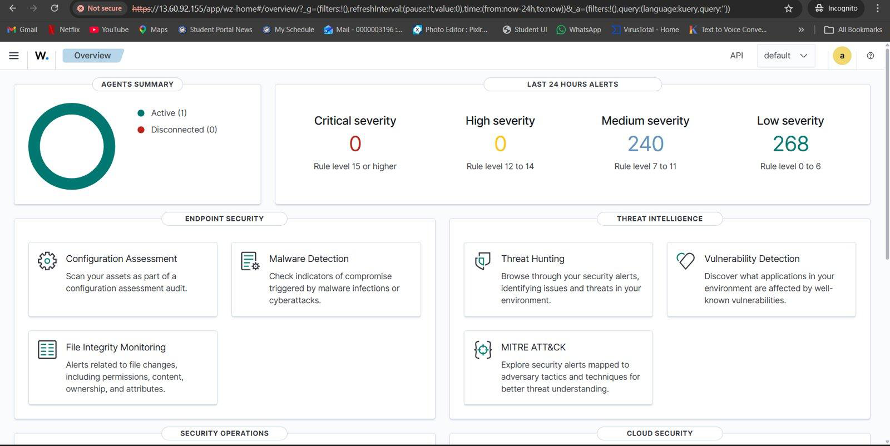
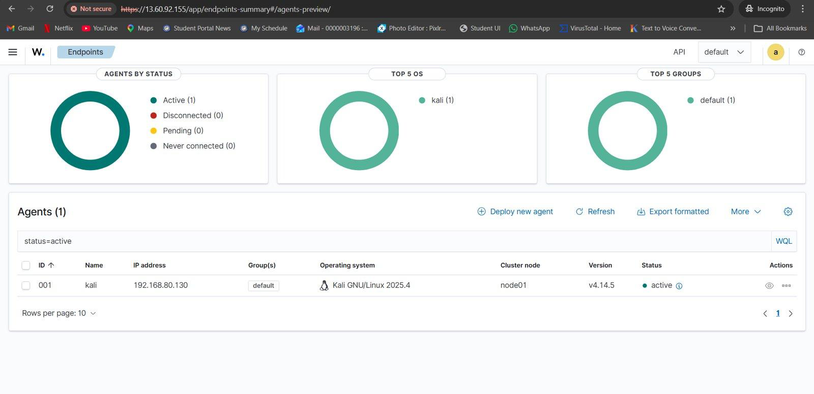
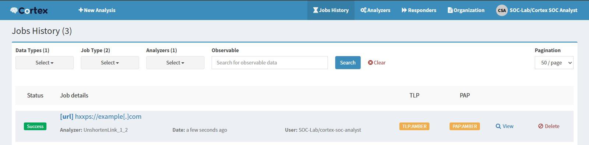
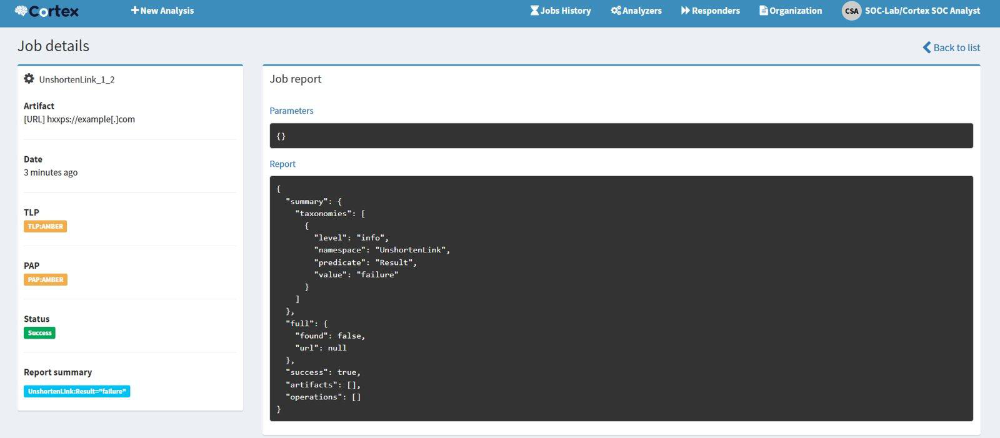
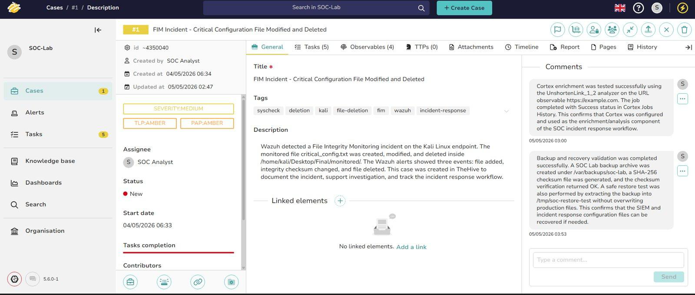
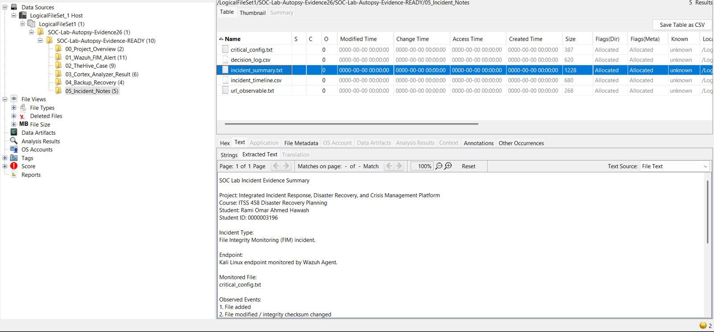

# Integrated SOC Platform: Detection, Case Management, Enrichment, Recovery, and DFIR

A hands-on Security Operations Center (SOC) lab that demonstrates an end-to-end incident response workflow using **Wazuh**, **TheHive**, **Cortex**, **Docker**, Linux endpoint monitoring, backup integrity validation, and optional DFIR review with **Autopsy**.

The project focuses on a controlled File Integrity Monitoring (FIM) incident where a monitored Linux configuration file is created, modified, and deleted. The activity is detected by Wazuh, documented as a TheHive incident case, enriched through Cortex, validated through backup and restore testing, and reviewed using Autopsy.

---

## Table of Contents

- [Project Scope](#project-scope)
- [Architecture](#architecture)
- [Technology Stack](#technology-stack)
- [Incident Scenario](#incident-scenario)
- [Repository Structure](#repository-structure)
- [Evidence Gallery](#evidence-gallery)
- [Implementation Evidence Notes](#implementation-evidence-notes)
- [Disaster Recovery Validation](#disaster-recovery-validation)
- [Crisis Management Summary](#crisis-management-summary)
- [Security and Redaction Policy](#security-and-redaction-policy)
- [Key Outcomes](#key-outcomes)
- [Limitations](#limitations)
- [How to Read This Repository](#how-to-read-this-repository)

---

## Project Scope

This repository documents the implementation of an integrated SOC-style workflow:

```text
Detection → Triage → Case Management → Enrichment → Recovery Validation → DFIR Review
```

The objective is not only to install security tools, but to demonstrate a practical operational flow where evidence is generated, reviewed, documented, enriched, and validated.

The project includes:

- Endpoint monitoring using Wazuh Agent on Kali Linux
- File Integrity Monitoring using Wazuh FIM/syscheck
- Case documentation and response tracking using TheHive
- Observable enrichment using Cortex analyzers
- Docker-based deployment of TheHive, Cortex, and supporting services
- Backup archive creation and SHA-256 integrity verification
- Safe restore validation into a non-production test directory
- Optional DFIR evidence indexing and reporting using Autopsy

---

## Architecture

The SOC lab follows this high-level architecture:

```text
Kali Linux Endpoint
        ↓
Wazuh Agent / FIM Monitoring
        ↓
Wazuh Manager + Dashboard
        ↓
TheHive Case Management
        ↓
Cortex Observable Enrichment
        ↓
Backup / Recovery Validation
        ↓
Autopsy DFIR Evidence Review
```

Architecture and workflow diagrams are included in the evidence gallery.

---

## Technology Stack

| Component | Purpose |
|---|---|
| Wazuh | SIEM/XDR layer used for endpoint monitoring and FIM alerting |
| Wazuh Agent | Endpoint agent installed on Kali Linux |
| Kali Linux | Monitored endpoint used to generate the controlled FIM incident |
| TheHive | Incident case management, observables, tasks, and analyst comments |
| Cortex | Observable enrichment using analyzers |
| Docker / Docker Compose | Containerized deployment for TheHive, Cortex, and supporting services |
| AWS EC2 | Lab server used to host SOC services |
| SHA-256 / tar | Backup integrity and archive validation |
| Autopsy | Optional DFIR review, indexing, keyword search, and reporting |

---

## Incident Scenario

The simulated incident is based on file integrity monitoring.

A monitored file named:

```text
critical_config.txt
```

was created, modified, and deleted on the Kali Linux endpoint.

The controlled sequence was:

1. Create a monitored directory.
2. Create `critical_config.txt`.
3. Modify the file to simulate unauthorized configuration tampering.
4. Delete the file to simulate suspicious removal.
5. Validate that Wazuh generated FIM alerts.
6. Document the incident in TheHive.
7. Add observables and response tasks.
8. Run Cortex enrichment on a test URL observable.
9. Validate backup integrity and restore capability.
10. Review collected evidence in Autopsy.

---

## Repository Structure

Recommended public repository structure:

```text
SOC-Project
│
├── README.md
├── configs/
├── scripts/
└── docs/
    ├── assets/
    │   └── screenshots/
    │       ├── fig01_architecture.png
    │       ├── fig02_workflow.png
    │       ├── fig08_wazuh_overview_active.png
    │       ├── fig09_wazuh_endpoints_kali.png
    │       ├── fig13_wazuh_fim_3hits.png
    │       ├── fig22_thehive_case_success.png
    │       ├── fig23_thehive_observables.png
    │       ├── fig24_thehive_tasks.png
    │       ├── fig28_cortex_unshorten_enabled.png
    │       ├── fig29_cortex_jobs_history.png
    │       ├── fig30_cortex_job_details.png
    │       ├── fig32_thehive_both_comments.png
    │       ├── fig37_autopsy_filetree.png
    │       ├── fig38_autopsy_keyword.png
    │       └── fig39_autopsy_report.png
    │
    └── evidence/
        ├── implementation-notes.md
        ├── recovery-validation.md
        └── security-redaction.md
```

Only the selected public screenshots should be placed under:

```text
docs/assets/screenshots/
```

Raw screenshots, credentials, infrastructure screenshots, and private lab material should not be uploaded to the public repository.

---

## Evidence Gallery

The public GitHub evidence set intentionally uses **15 screenshots only**. These screenshots show the highest-value visual evidence without exposing unnecessary terminal output, credentials, infrastructure details, or repeated setup screens.

### 1. Architecture and Workflow




### 2. Wazuh Detection Layer






### 3. TheHive Case Management


### 4. Cortex Enrichment






### 5. Recovery Documentation and DFIR Review






---

## Implementation Evidence Notes

Some implementation evidence is better represented as text instead of screenshots. Terminal output, service commands, backup commands, and sensitive infrastructure details are documented in Markdown because this is more readable and safer for a public repository.

### Wazuh Endpoint Validation

Wazuh was used as the detection layer. A Kali Linux endpoint was enrolled through the Wazuh agent and validated as active from the Wazuh dashboard.

The public repository does not include generated Wazuh credentials, internal URLs, or raw installation output.

### FIM Incident Commands

The controlled FIM incident was generated using the following logic:

```bash
mkdir -p /home/kali/Desktop/Final/monitored

echo "Original secure configuration" > /home/kali/Desktop/Final/monitored/critical_config.txt

echo "UNAUTHORIZED CONFIG - simulated attacker modification" >> /home/kali/Desktop/Final/monitored/critical_config.txt

rm /home/kali/Desktop/Final/monitored/critical_config.txt
```

Expected detection result:

```text
Wazuh FIM alerts showing:
- file added
- integrity checksum changed
- file deleted
```

### Docker-Based IR Stack

TheHive and Cortex were deployed with Docker Compose. Supporting services included Cassandra, Elasticsearch, and Nginx.

Instead of publishing raw `docker compose ps` screenshots, this repository documents the outcome:

```text
TheHive: running
Cortex: running
Cassandra: running
Elasticsearch: running
Nginx/reverse proxy: running
```

### TheHive Incident Response Case

The Wazuh FIM incident was documented in TheHive as a manual incident response case. The case included:

- Incident title and summary
- Severity classification
- Tags
- Endpoint observable
- File path observable
- File name observable
- URL observable for enrichment testing
- Analyst tasks
- Analyst comments documenting enrichment and recovery validation

### Cortex Enrichment

Cortex was configured as the enrichment layer. The `UnshortenLink_1_2` analyzer was enabled and executed against a URL observable.

The analyzer job completed successfully and the result was documented inside TheHive.

---

## Disaster Recovery Validation

Disaster recovery validation was performed using:

- compressed backup archive
- SHA-256 checksum generation
- SHA-256 checksum verification
- safe restore test into a non-production directory

Integrity verification command:

```bash
sha256sum -c soc_lab_backup_YYYY-MM-DD_HH-MM-SS.tar.gz.sha256
```

Expected result:

```text
soc_lab_backup_YYYY-MM-DD_HH-MM-SS.tar.gz: OK
```

Safe restore location:

```text
/tmp/soc-restore-test
```

The restore test was intentionally performed in a safe test directory to avoid overwriting production configuration paths.

---

## Crisis Management Summary

The simulated incident was treated as a medium-severity configuration integrity event.

### Classification

| Item | Decision |
|---|---|
| Severity | Medium |
| Reason | A monitored configuration file was created, modified, and deleted on one endpoint |
| Confirmed Data Breach | No |
| Confirmed Service Outage | No |
| Escalation Trigger | Escalate if multiple endpoints, privileged misuse, persistence, data exposure, or production outage are confirmed |

### Response Stakeholders

| Stakeholder | Role |
|---|---|
| SOC Analyst | Validate alert, collect evidence, document case |
| Incident Response Lead | Approve containment and recovery actions |
| System Administrator | Validate endpoint state and restore configuration if needed |
| IT Management | Receive incident summary and approve major decisions |
| Legal / Compliance | Review notification obligations if data exposure is confirmed |

---

## Security and Redaction Policy

This public repository intentionally excludes sensitive operational details.

Do not upload:

- generated credentials
- passwords
- API keys
- tokens
- public IP addresses
- internal service URLs
- AWS security group identifiers
- raw terminal output exposing hostnames or paths that are not needed
- screenshots showing browser address bars with sensitive lab URLs

Infrastructure and credential evidence should remain in private notes only.

Public screenshots should be used only when they demonstrate meaningful project value, such as architecture, detection, case management, enrichment, recovery documentation, and DFIR review.

---

## Key Outcomes

The project demonstrates:

- successful deployment of an integrated SOC workflow
- endpoint monitoring through Wazuh Agent
- FIM detection for file creation, modification, and deletion
- incident documentation in TheHive
- observable enrichment through Cortex
- backup integrity validation using SHA-256
- safe restore testing
- DFIR evidence review using Autopsy
- crisis classification and response planning
- professional public evidence selection for GitHub and LinkedIn

---

## Limitations

This project was implemented in a controlled lab environment.

The following were not included in the public repository:

- production secrets
- live infrastructure endpoints
- complete credential screenshots
- raw cloud security group details
- full private evidence archive

The TheHive case was created manually from Wazuh evidence. This is acceptable for a lab workflow, but a production deployment should automate alert forwarding and case creation where possible.

---

## How to Read This Repository

For a quick overview:

1. Start with the architecture and workflow diagrams.
2. Review the Wazuh detection screenshots.
3. Review the TheHive case, observables, and tasks.
4. Review Cortex analyzer evidence.
5. Review TheHive comments and Autopsy DFIR evidence.
6. Read the implementation and recovery notes for details that are better documented as text than as screenshots.

This repository is designed as a public portfolio project. It prioritizes clear evidence, safe redaction, and professional presentation over uploading every raw screenshot captured during the lab.
