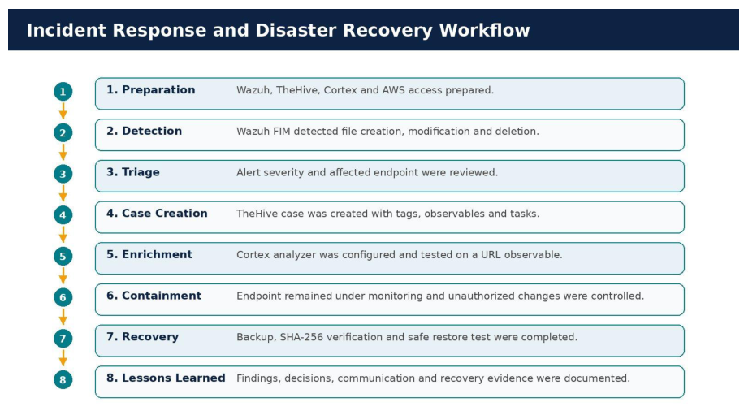
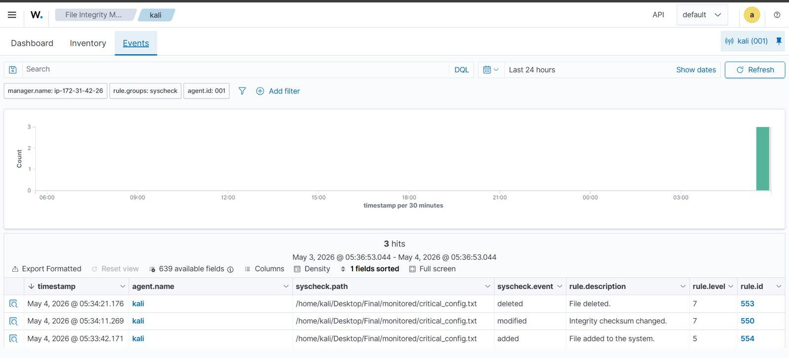
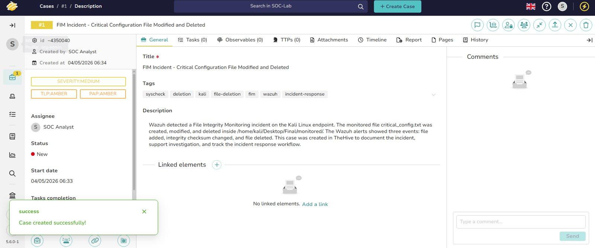
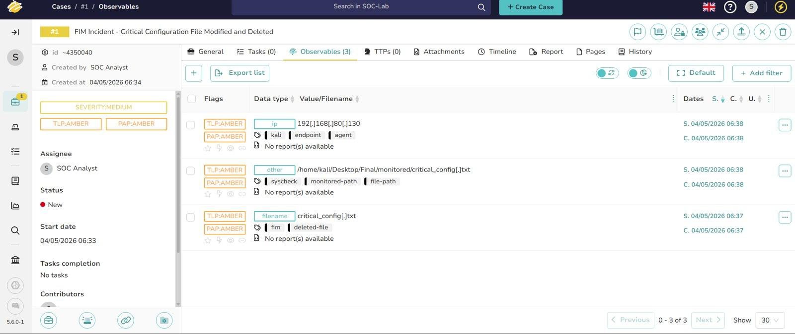
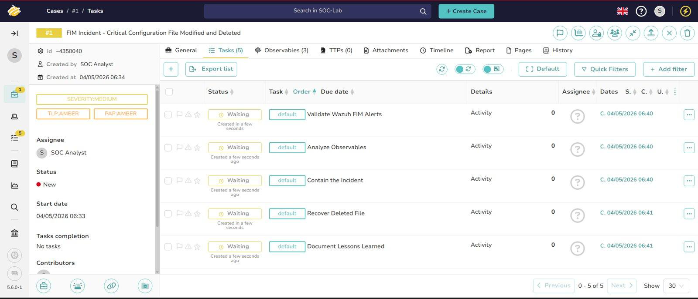
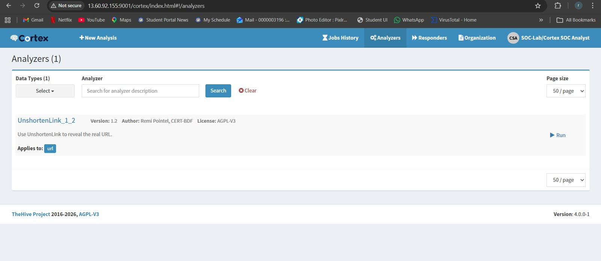
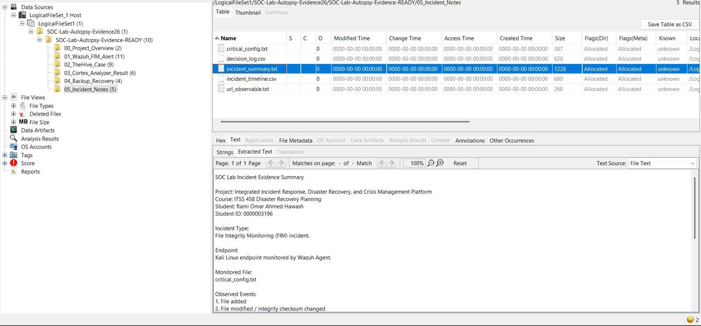
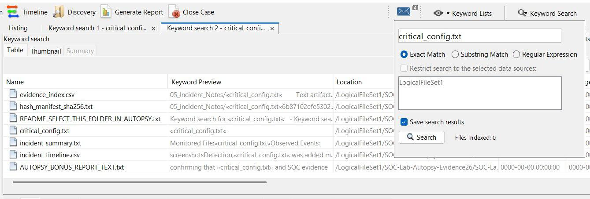
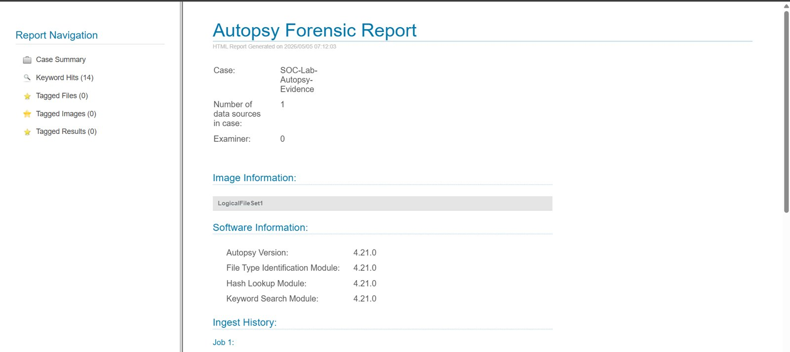

# Integrated SOC Platform: Wazuh, TheHive, Cortex, Recovery, and DFIR

A hands-on SOC lab that demonstrates an end-to-end security operations workflow: endpoint monitoring, file integrity detection, case management, observable enrichment, backup validation, and forensic evidence review.

The lab simulates unauthorized changes to a monitored Linux configuration file and follows the incident from detection through documentation, enrichment, recovery validation, and DFIR review.

---

## Workflow

```text
Linux Endpoint
    ↓
Wazuh FIM Detection
    ↓
TheHive Case Management
    ↓
Cortex Observable Enrichment
    ↓
Backup and Restore Validation
    ↓
Autopsy DFIR Review
```

---

## Stack

| Component | Role |
|---|---|
| Wazuh | SIEM/XDR and File Integrity Monitoring |
| Wazuh Agent | Linux endpoint monitoring |
| TheHive | Incident case management |
| Cortex | Observable enrichment and analyzer execution |
| Docker Compose | Containerized IR services |
| SHA-256 / tar | Backup integrity and restore validation |
| Autopsy | Offline DFIR evidence indexing and reporting |

---

## Scenario

A Kali Linux endpoint was monitored with Wazuh FIM. A file named `critical_config.txt` was created, modified, and deleted to simulate suspicious configuration tampering.

The event was then handled as a SOC incident:

1. Wazuh detected file creation, modification, and deletion.
2. The incident was documented as a TheHive case.
3. Observables and response tasks were added.
4. Cortex enrichment was executed using an analyzer.
5. Backup integrity was verified using SHA-256.
6. A restore test was performed in a safe directory.
7. Evidence was reviewed in Autopsy.

---

## Repository Structure

```text
SOC-Project
│
├── README.md
├── SECURITY.md
├── configs/
│   └── ossec-fim.xml
├── scripts/
│   └── backup_recovery.sh
└── docs/
    ├── assets/
    │   └── screenshots/
    └── evidence/
        ├── implementation-notes.md
        └── recovery-validation.md
```

---

## Evidence Gallery

### Architecture and Workflow




### Wazuh Detection




### TheHive Case Management







### Cortex Enrichment




### Recovery and DFIR Review








---

## Implementation Notes

Additional implementation details are documented in:

```text
docs/evidence/implementation-notes.md
```

The notes include the FIM test commands, Docker stack summary, TheHive case fields, and Cortex enrichment result.

---

## Recovery Validation

Recovery validation is documented in:

```text
docs/evidence/recovery-validation.md
```

The validation includes backup creation, SHA-256 checksum verification, and a safe restore test under `/tmp/soc-restore-test`.

---

## Configuration

The Wazuh FIM monitoring configuration sample is available at:

```text
configs/ossec-fim.xml
```

The configuration monitors the lab directory used for the FIM scenario with real-time integrity checking.

---

## Key Outcomes

This lab demonstrates:

- Linux endpoint enrollment and monitoring
- File Integrity Monitoring with Wazuh
- Detection of file creation, modification, and deletion
- Incident documentation in TheHive
- Observable handling and task-based response tracking
- Cortex analyzer execution
- Backup integrity validation using SHA-256
- Safe restore testing
- DFIR evidence indexing and reporting with Autopsy

---

## Limitations

This is a controlled lab environment. TheHive case creation was performed manually from Wazuh evidence. A production deployment should use automated alert forwarding, stronger access controls, centralized secrets management, and hardened network exposure.

---

## Security

This repository contains sanitized lab material only. Credentials, tokens, public IP addresses, private service URLs, and generated access information are intentionally excluded.

See:

```text
SECURITY.md
```
